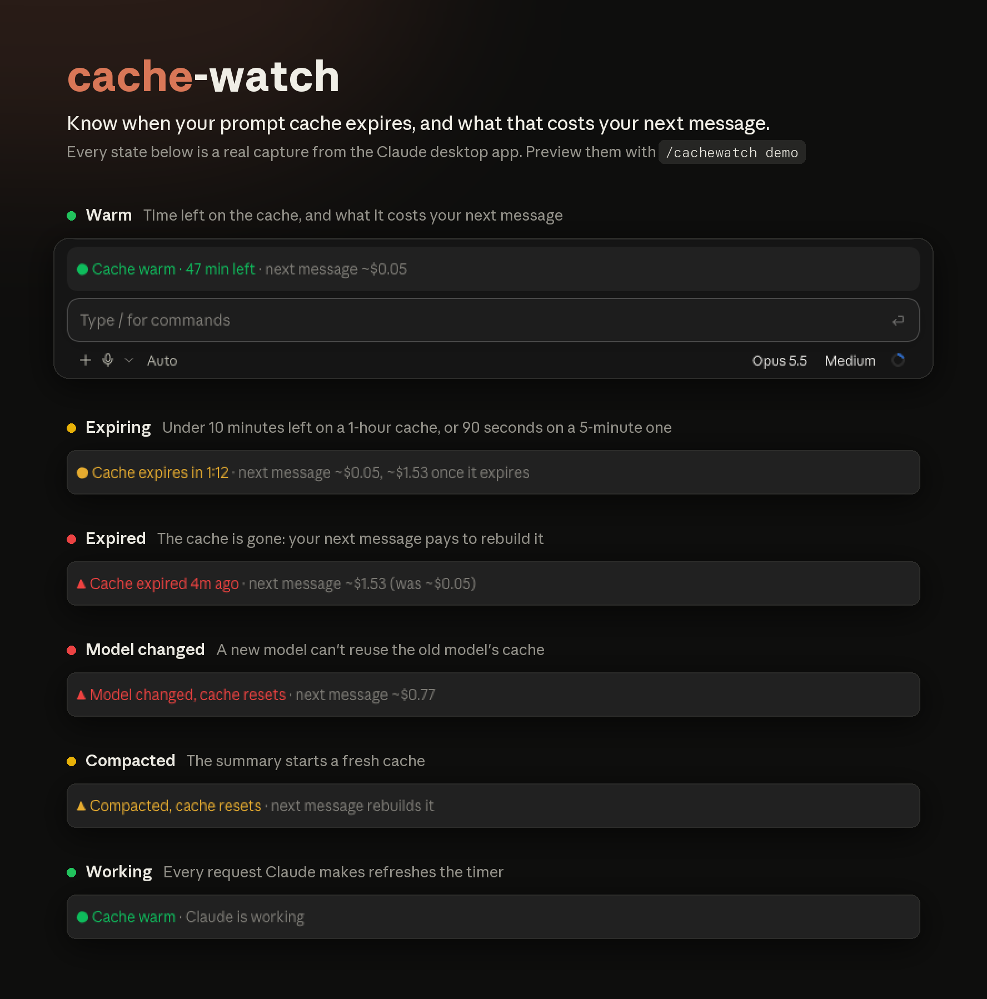

<p align="center">
  
</p>

# cache-watch

**Know when your Claude Code prompt cache expires, and what that costs your next message.**

Claude Code caches your conversation so each message pays full price only for what's new. The cache expires 5 minutes or 1 hour after its last use, depending on your account. After that, your next message rewrites the whole conversation, which can cost about 15× more late in a long session. cache-watch adds a one-line band above the prompt that counts down to that moment.

## Features

- **Live countdown** to the cache expiring, in the terminal and the desktop app
- **Your account's real TTL**, read from the API's own responses rather than guessed
- **Next-message cache cost**, and what it will be once the cache expires
- **Warnings** for anything that resets the cache: expiry, switching models, `/compact`

## Requirements

- Claude Code 2.1.284 or later, in the terminal or the desktop app
- Function hooks, an early-access Claude Code feature. The API may change between releases.

## Install

In Claude Code:

```
/plugin marketplace add ishuagrawal/cache-watch
/plugin install cache-watch
```

Or from a shell:

```bash
claude plugin marketplace add ishuagrawal/cache-watch
```

```bash
claude plugin install cache-watch
```

Then start a new session (or run `/reload-plugins`). The band appears after Claude's first reply. To check it's working right away, run `/cachewatch demo`.

**Update:** `claude plugin marketplace update cache-watch`, then `claude plugin update cache-watch`.
**Uninstall:** `claude plugin uninstall cache-watch`, then `claude plugin marketplace remove cache-watch`.

## Usage

The band needs no setup. It changes with the cache:

| State | Shown when |
| --- | --- |
| 🟢 **Warm** | The cache is live. Shows the time left and the next message's cache cost |
| 🟡 **Expiring** | Under 10 min left on a 1-hour cache, or 90 s on a 5-minute one |
| 🔴 **Expired** | The cache is gone, so the next message rewrites it |
| 🔴 **Model changed** | A different model can't reuse the old cache |
| 🟡 **Compacted** | `/compact` replaced the conversation, so the cache starts fresh |
| 🟢 **Working** | Claude is mid-turn, and each request refreshes the timer |

| Command | What it does |
| --- | --- |
| `/cachewatch` | Toggle the band on or off (remembered across sessions) |
| `/cachewatch on` · `off` | Turn it on or off explicitly |
| `/cachewatch demo` | Preview every state, 3 s each |
| `/cachewatch demo <state>` | Show one state for 15 s: `warm`, `expiring`, `expired`, `model`, `compacted`, `working` |
| `/cachewatch refresh` | Re-read the session transcript now |

## How it works

- **TTL:** each API response records its cache writes split by lifetime (`ephemeral_1h_input_tokens` / `ephemeral_5m_input_tokens`). Claude Code saves those responses to the session transcript, and cache-watch reads the newest one after every turn.
- **Countdown:** the cache's lifetime runs from the *start* of the request that last used it, so the timer starts there too.
- **Cost:** a warm message pays a cache read on the existing context, plus a cache write on the new part. That write is 1.25× the input price for a 5-minute cache and 2× for 1 hour. An expired cache means the whole context is written again. Output isn't included: it costs the same whether the cache is warm or not, and depends on what you ask.

<details>
<summary>Prices used (per million tokens, Anthropic API list prices, September 2026)</summary>

| Model | Input | Cache read |
| --- | --- | --- |
| Fable 5.1 | $10 | $0.25 |
| Opus 5.5 | $4 | $0.20 |
| Opus 5 · 4.8 · 4.7 · 4.6 | $5 | $0.50 |
| Sonnet 5.5 · 5 | $2 | $0.20 |
| Sonnet 4.6 | $3 | $0.30 |
| Haiku 4.5 | $1 | $0.10 |

Fast mode is billed at 2×. Prices live in `PRICES` in [`plugin/hooks/register.tsx`](./plugin/hooks/register.tsx).

</details>

## Limitations

- **Costs are estimates at API list prices.** On a Pro or Max plan you don't pay per message, so read them as relative cost: an expired cache uses up your limits faster.
- **Some cache breaks aren't detected**, such as changing effort mid-conversation or editing `CLAUDE.md`.
- **No Bedrock or Vertex pricing.**
- **A TTL change shows up one response late.** For example, a plan dropping to 5 minutes during usage overage only appears after the next response that writes to the cache.

## Development

```bash
git clone https://github.com/ishuagrawal/cache-watch.git
```

```bash
claude --plugin-dir ./cache-watch/plugin
```

Edits hot-reload in the running session. In the desktop app, which can't take flags, set the folder in `~/.claude/settings.json` instead:

```json
{ "env": { "CLAUDE_CODE_PLUGIN_DIRS": "/absolute/path/to/cache-watch/plugin" } }
```

Run the tests, which draw the band on the terminal and desktop surfaces and check the TTL, countdown and cost against a sample transcript:

```bash
claude plugin test cache-watch/plugin
```

```
.claude-plugin/marketplace.json   marketplace entry
plugin/hooks/register.tsx         the mod: transcript reading, pricing, the band
plugin/types/index.d.ts           types for the state it keeps
plugin/tests/band.test.ts         tests
media/                            header image and the script that lays it out
```

Issues and pull requests are welcome, especially price updates when new models ship.

## License

[MIT](./LICENSE) © Ishu Agrawal
